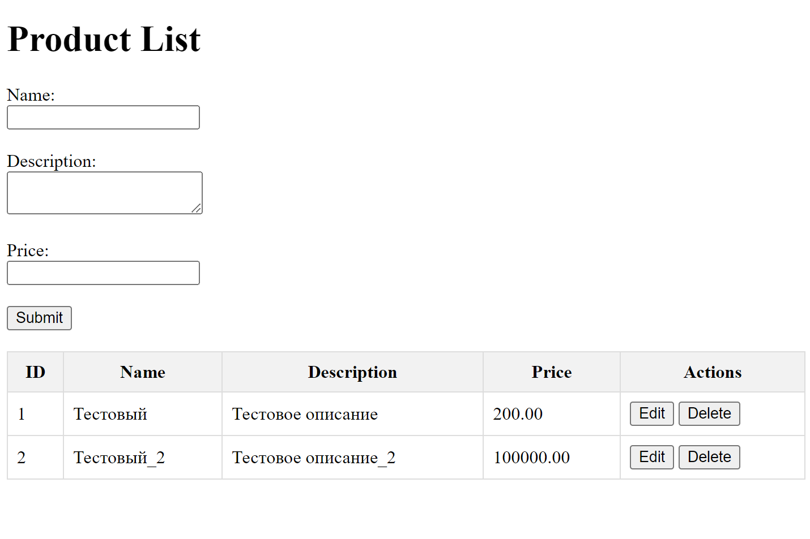

# BrendWall_test_task
## Тестовое задание: API для продуктов и работа с фронтендом

#### Описание:
Необходимо создать небольшое Django-приложение, которое будет состоять из двух частей:

- API для работы с продуктами (создание и получение списка).
- Страница на HTML с использованием JavaScript для отправки данных на API и отображения продуктов.
Требования:

## API (Django):

- Создайте модель продукта с полями: название (строка), описание (текст), цена (десятичное число).
- Реализуйте API с двумя конечными точками:
  - POST-запрос для создания продукта (принимает JSON с данными: название, описание, цена).
  - GET-запрос для получения списка всех продуктов в формате JSON.
- При создании продукта должны выполняться простые проверки (например, цена должна быть положительным числом, название — не пустым).

## Фронтенд (HTML + JavaScript):

- Создайте простую HTML-страницу с формой для добавления нового продукта (поля: название, описание, цена) и кнопкой "Отправить".
- Реализуйте логику с помощью JavaScript, которая отправляет данные формы на API с использованием AJAX (Fetch API).
- После успешного добавления продукта обновите список продуктов на странице, сделав GET-запрос к API для получения всех продуктов и отобразив их в виде таблицы.


## Требования
- Django
- DRF
- SQLite


## Установка и запуск

### 1. Сборка Docker-образа

Перед запуском проекта убедитесь, что Docker и Docker Compose установлены на вашей машине. Затем выполните следующую команду для сборки Docker-образа:

```bash
docker-compose build
```

### 2. Запуск контейнеров

После успешной сборки образа запустите контейнеры с помощью команды:

```bash
docker-compose up
```

# Структура проекта

- /admin - админ панель
- /api - доступ к API DRF проекта
- api/ products/ - GET, POST запрос к товарам
- api/ products/<int:pk>/ - GET, POST запрос к конкретному товару
- api/ products/list/ - Frontend HTML + CSS + JS

## Frontend

Для добавления товара нужно заполнить поля _Name_, _Description_, _Price_. После этого добавить кнопку **Submit**.



- Чтобы удалить товар, нужно нажать на кнопку **Delete** в столбце _Actions_
- Чтобы изменить, то нажать на кнопку **Edit** в столбце _Actions_ 